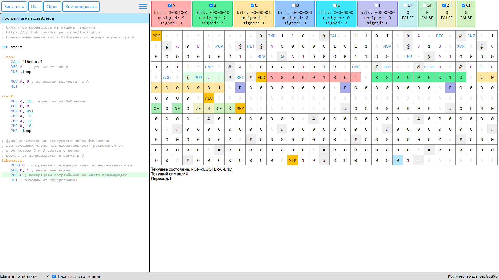

# TuringCpu
Симулятор x86 подобного процессора на машине Тьюринга, использующий упрощённый синтаксис ассемблера на основе NASM. Программа, АЛУ, флаги, регистры, память и стек находятся на одной общей ленте единственной машины Тьюринга.


## Конфигурация
* Произвольная точность вычислений (битность), по умолчанию 8 бит
* Произвольное количество ячеек памяти, по умолчанию 16
* Шесть регистров общего назначения: `A`, `B`, `C`, `D`, `E`, `F`
* Флаги:
    * переполнения (`OF`)
    * знака (`SF`)
    * нуля (`ZF`)
    * переноса (`CF`)
* поддержка отрицательных чисел

## Синтаксис

* Каждая инструкция располагается на отдельной строке
* Метки должны начинаться с буквы или точки (`.`) и заканчиваться двоеточием
* Комментарий начинается с символа `;`
* Адреса заключаются в квадратные скобки `[address]` и обозначает номер ячейки памяти
* В качестве адреса может быть положительная константа (`[12]`) или регистр общего назначения (`[A]`)
* Операндами команд могут быть регистры общего назначения, константы, адреса или метки

Общий вид строки программы: `метка: инструкция аргументы ; комментарий`

## Допустимые форматы констант:

* Двоичный: `0b1111011` или `1111011b`
* Восьмеричный: `0o173`
* Десятичный: `123` или `123d` (в том числе со знаком `-123`)
* Шестнадцатиричный: `0x7B`

## Команда MOV
Помещает содержимое аргумента `arg2` в аргумент `arg1`

Допустимая конфигурация аргументов:
* `MOV регистр, регистр/константа/адрес`
* `MOV адрес, регистр/константа`

Синтаксис: `MOV arg1, arg2`

## Стековые инструкции
### Команда PUSH - добавить в стек
Добавляет переданное значение в стек

Синтаксис: `PUSH arg`

### Команда POP - извлечь из стека
Извлекает значение из стека и помещает его на переданный регистр. Если стек пуст, происходит ошибка.

Синтаксис: `POP reg`

## Математические операции
Модифицируют значения флагов `OF`, `SF`, `ZF` и `CF`

* Сложение: `ADD reg, arg`
* Вычитание: `SUB reg, arg`
* Умножение: `MUL reg, arg` (без поддежрки `OF` пока)
* Деление: `DIV reg, arg` (без поддежрки `OF` пока)
* Инкремент: `INC reg`
* Декремент: `DEC reg`
* Изменение знака: `NEG reg`

## Логические операции
Модифицируют значение флагов `ZF` и `SF`. Флаги `OF` и `CF` сбрасываются

* И: `AND reg, arg`
* ИЛИ: `OR reg, arg`
* Исключающее ИЛИ: `XOR reg, arg`
* НЕ: `NOT reg`

## Битовые сдвиги
Модифицируют значение флагов `SF`, `ZF` и `CF`. Флаг `OF` сбрасывается
* Сдвиг влево: `SHL reg, arg`
* Сдвиг вправо: `SHR reg, arg`
* Циклический сдвиг влево: `ROL reg`
* Циклический сдвиг вправо: `ROR reg`

## Команда CMP
Выполняет вычитание двух чисел. Результат никуда не записывается, модифицируются значения флагов `OF`, `SF`, `ZF` и `CF`

Синтаксис: `CMP reg, arg`

## Команда TEST
Выполняет логическое И. Результат никуда не записывается, модифицируются значения флагов `ZF` и `SF` и сбрасываются состояния флагов `OF` и `CF`

Синтаксис: `TEST reg, arg`

## Переходы
### Безусловный переход (JMP)
Производит передачу управления на инструкцию, помеченную указанной меткой

Синтаксис: `JMP label`

### Условные переходы
Работают аналогично безусловному переходу, предварительно проверяя некоторое условие:

* `JO` - перейти, если переполнение (`OF = 1`)
* `JNO` - перейти, если нет переполнения (`OF = 0`)
* `JS` - перейти, если знак равен 1 (`SF = 1`)
* `JNS` - перейти, если знак равен 0 (`SF = 0`)
* `JZ` - перейти, если ноль (`ZF = 1`)
* `JNZ` - перейти, если не ноль (`ZF = 0`)
* `JC` - перейти, если перенос (`CF = 1`)
* `JNC` - перейти, если нет переноса (`CF = 0`)
* `JE` - перейти, если равно (`ZF = 1`)
* `JNE` - перейти, если не равно (`ZF = 0`)

#### Переходы беззнакового сравнения

* `JB` - перейти, если меньше (`CF = 1`)
* `JBE` - перейти, если меньше или равно (`CF = 1` или `ZF = 1`)
* `JA` - перейти, если больше (`ZF = 0` и `CF = 0`)
* `JAE` - перейти, если больше или равно (`CF = 0`)
* `JNB` - перейти, если не меньше (`not <`)
* `JNBE` - перейти, если не меньше или равно (`not ≤`)
* `JNA` - перейти, если не больше (`not >`)
* `JNAE` - перейти, если не больше или равно (`not ≥`)

#### Переходы знакового сравнения

* `JL` - перейти, если меньше (`SF ≠ OF`)
* `JLE` - перейти, если меньше или равно (`ZF = 1` или `SF ≠ OF`)
* `JG` - перейти, если больше (`ZF = 0` и `SF = OF`)
* `JGE` - перейти, если больше или равно (`SF = OF`)
* `JNL` - перейти, если не меньше (`not <`)
* `JNLE` - перейти, если не меньше или равно (`not ≤`)
* `JNG` - перейти, если не больше (`not >`)
* `JNGE` - перейти, если не больше или равно (`not ≥`)

## Вызов подпрограммы - CALL
В стек помещается адрес следующей инструкции, используемый впоследствии командой RET и выполняется переход по указанной метке.

Синтаксис: `CALL label`

## Выход из подпрограммы - RET
Извлекает из стека адрес возврата и выполняет переход на инструкцию по извлечённому адресу.

Синтаксис: `RET`

## Команда HLT
Немедленно завершает работу процессора

Синтаксис: `HLT`

## Пример программы
```asm
JMP start

.loop:
    PUSH B ; сохраняем предыдущий член последовательности
    ADD B, C ; вычисляем новый
    POP C ; возвращаем сохранённый на место предыдущего
    DEC A   ; уменьшаем номер
    JNZ .loop

    JMP end

start:
    MOV A, 11  ; номер числа Фибоначчи
    MOV C, 0x1
    JMP .loop

end:
    XOR A, B
```

## Скриншоты работы



